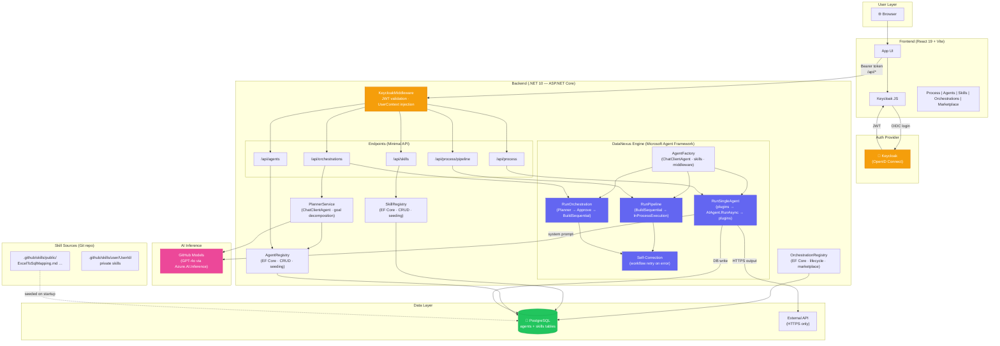

# DataNexus — Copilot Instructions

## Project Overview

DataNexus is a decentralized, multi-agent AI "Kernel" where users author, use, and share
**Skills** (agentic logic). It is structured as a **monorepo** with two workspaces:

| Workspace   | Path        | Stack                                             |
| ----------- | ----------- | ------------------------------------------------- |
| **Backend** | `backend/`  | .NET 10 (C# 13), ASP.NET Core Minimal APIs, EF Core + PostgreSQL |
| **Frontend**| `frontend/` | React 19, TypeScript, Vite                        |
| **Skills**  | `.github/skills/` | Shared markdown-based skill definitions      |

---

## Architecture



### Backend (The DataNexus System)

- **Auth**: Keycloak OpenID Connect. JWT validated via `Microsoft.AspNetCore.Authentication.JwtBearer`.
  `KeycloakMiddleware` injects a scoped `UserContext` and logs agent chatter with `[User: {Id}]`.
- **Agents** (composable): Stored in PostgreSQL (`agents` table) via EF Core. Users can create,
  customize, and publish agents. Each agent has:
  - `ExecutionType` — `Llm` (default) or `External` (CLI / script).
  - `SystemPrompt` — the LLM system instructions (LLM agents).
  - `Command` / `Arguments` / `WorkingDirectory` / `TimeoutSeconds` — execution metadata (external agents).
  - `Plugins` — comma-separated list (e.g. `InputProcessor,OutputIntegrator`).
  - `Skills` — comma-separated skill names injected into the system prompt at runtime.
  - `UiSchema` — JSON array defining the agent's custom UI fields (see **Agent UI Schema** below).
  - `Scope` — `Public` or `Private`; public agents are visible to all users.
  - Built-in agents (Data Analyst, API Integrator, Report Writer, Data Validator) are seeded on startup.
- **DataNexusEngine**: Dynamic agent orchestrator built on **Microsoft Agent Framework** (v1.0.0-rc4). Supports:
  - **AgentFactory** — creates `ChatClientAgent` (AF's `IChatClient`-backed `AIAgent`) from database-stored
    agent definitions. Resolves skills, builds instructions, and wraps with AF audit-logging middleware.
  - **Single-agent execution** — `AgentFactory.CreateAgentAsync()` → `AIAgent.RunAsync()`,
    with deterministic plugin sandwich (InputProcessor → LLM → OutputIntegrator).
  - **External agent execution** — `ExternalAgentAdapter` wraps `ExternalProcessRunner` as an AF `AIAgent`,
    enabling external CLI/script agents to participate in AF sequential workflows.
  - **Pipeline execution** — uses `AgentWorkflowBuilder.BuildSequential()` + `InProcessExecution.RunAsync()`
    to chain agents. Each agent's plugins are embedded as AF middleware for self-contained execution.
  - **Self-correction** — on plugin error or schema mismatch, retries the entire workflow (up to 3 attempts).
  - **Default mode** — if no `AgentId` specified, falls back to Analyst → Integrator workflow via `BuildSequential`.
- **External Agent Runtime** (`ExternalProcessRunner`):
  - Executes CLI / Python / Node / shell scripts as child processes.
  - **Protocol**: JSON on stdin → JSON on stdout. Exit code 0 = success.
  - **Security**: command allowlist (`ExternalAgents:AllowedCommands`), working directory allowlist,
    hard timeout cap (`ExternalAgents:MaxTimeoutSeconds`), no shell invocation (`UseShellExecute=false`).
  - Config section: `ExternalAgents` in `appsettings.json`.
- **Orchestrations** (LLM-planned workflows): Stored in PostgreSQL (`orchestrations` table) via EF Core.
  `PlannerService` uses a MAF `ChatClientAgent` to decompose a user goal into ordered agent steps.
  The plan is saved as a `Draft` and requires explicit user approval before execution.
  - **Status lifecycle**: `Draft → Approved → Running → Completed/Failed` or `Draft → Rejected`.
    Users can also `ResetToDraft` to revise a rejected or failed plan.
  - **PlannerService**: Creates a `ChatClientAgent` with a system prompt containing agent catalog +
    decomposition rules, wrapped with AF audit-logging middleware. Parses the LLM response into
    `OrchestrationStep` objects, validating agent IDs against the registry.
  - **Approval gate**: Only `Approved` orchestrations can execute. The frontend shows the plan steps,
    lets users swap agents, override prompts, remove steps, then approve or reject.
  - **Execution**: `RunOrchestrationAsync` resolves agent definitions (with any prompt overrides),
    builds AF agents via `CreateOrchestrationStepAgentAsync`, chains them with
    `AgentWorkflowBuilder.BuildSequential`, and executes via `InProcessExecution.RunAsync`.
  - **Marketplace**: Only `Approved` + `Private` orchestrations can be published. Users can clone
    public orchestrations into their own workspace.
  - REST API: `POST /api/orchestrations/plan`, `GET/PUT/DELETE /api/orchestrations/{id}`,
    `POST .../approve`, `POST .../reject`, `POST .../reset`, `POST .../run`,
    `POST .../publish`, `POST .../unpublish`, `POST .../clone`.
- **Pipelines**: Stored in PostgreSQL (`pipelines` table) via EF Core. `PipelineRegistry` provides
  full CRUD (list, get, create, update, delete, publish). Each pipeline has:
  - `Name` — display name.
  - `AgentIds` — JSON array of agent IDs executed sequentially.
  - `EnableSelfCorrection` — whether to retry on schema mismatch.
  - `MaxCorrectionAttempts` — cap on retries (default 3).
  - `Scope` — `Public` or `Private`; publishable to marketplace.
  - REST API: `GET/POST/PUT/DELETE /api/pipelines`, `POST /api/pipelines/{id}/publish`.
- **Skills**: Stored in PostgreSQL (`skills` table) via EF Core. `SkillRegistry` queries the
  database and injects instructions into agent system prompts at runtime.
  Built-in skills from `.github/skills/public/` are seeded into the DB on startup.
- **Plugins**: C# classes that perform real I/O before or after the LLM call. Registered per-agent
  via the `Plugins` comma-separated field. Two built-in plugins:
  - `InputProcessor` — runs **before** the LLM: parses Excel / CSV / JSON, downloads URLs.
    Transparently decompresses gzip-compressed data URLs (see **File Compression** below).
  - `OutputIntegrator` — runs **after** the LLM: executes API calls, database writes, validates schemas.

#### Skills vs Plugins

| Aspect        | Skills                              | Plugins                                  |
| ------------- | ----------------------------------- | ---------------------------------------- |
| **What**      | Markdown text                       | C# code (implements `IPlugin`)           |
| **When**      | Injected into system prompt before LLM call | Execute before/after the LLM call   |
| **Purpose**   | Shape *how the LLM thinks*          | Give the agent *ability to act*          |
| **Authored by** | Any user (markdown)               | Developers (backend code)                |
| **Side effects** | None — passive knowledge         | Yes — file I/O, HTTP, database writes    |

Execution flow per LLM agent:
```
InputProcessor plugin (optional) → LLM (with skill-enriched prompt) → OutputIntegrator plugin (optional)
```

#### File Compression

All file inputs (local upload, OneDrive, Google Drive) are **gzip-compressed** in the browser
before base64-encoding, using the native `CompressionStream` API. This reduces payload size
for text-heavy formats (CSV, JSON, plain text) by 70–85%. Already-compressed formats (`.xlsx`,
`.zip`, `.pdf`, images) are skipped automatically.

**Data URL format** (compressed): `data:application/gzip;x-original-type={originalMime};base64,...`

The backend `InputProcessorPlugin.DecompressIfGzipped()` detects this format, decompresses via
`GZipStream`, and reconstructs a standard `data:{originalMime};base64,...` URL before type
detection proceeds as normal. This is fully transparent to skill/agent authors.

The shared utility lives in `frontend/src/utils/compressFile.ts` (`toCompressedDataUrl`).

**Skills cannot invoke plugins.** This is an intentional security boundary. Skills are user-authored
untrusted text; plugins perform privileged side effects. Allowing skills to trigger plugins would be
a privilege escalation vector. Plugin activation is controlled exclusively by the agent's `Plugins`
configuration field, evaluated by the engine — never by skill content.

- **Database**: PostgreSQL via `Npgsql.EntityFrameworkCore.PostgreSQL`. Connection string in
  `ConnectionStrings:DataNexus`. Auto-migrated on startup.
- **Inference**: `IChatClient` from `Microsoft.Extensions.AI` via `OpenAI` SDK → GitHub Models (gpt-4o).
  All LLM agents are `ChatClientAgent` instances from Microsoft Agent Framework, backed by this `IChatClient`.

### Agent UI Schema

Each agent stores a `UiSchema` JSON array that defines the custom UI fields shown when the agent
is selected on the Process page. The frontend renders these dynamically. Field types:

| Type       | Renders As             | Extra Properties          |
| ---------- | ---------------------- | ------------------------- |
| `file`     | File drop zone         | `accept` (e.g. `.xlsx`)   |
| `text`     | Single-line input      | `placeholder`             |
| `textarea` | Multi-line input       | `placeholder`             |
| `url`      | URL input              | `placeholder`             |
| `select`   | Dropdown               | `options` (string array)  |
| `number`   | Numeric input          | `placeholder`             |
| `toggle`   | Checkbox + label       | `default` (`"true"/"false"`) |
| `onedrive-file` | OneDrive file picker button (lazy-loaded) | `accept` (e.g. `.xlsx`) |
| `google-drive-file` | Google Drive file picker button (lazy-loaded) | `accept` (e.g. `.xlsx`) |

Cloud file picker types (`onedrive-file`, `google-drive-file`) are **lazy-loaded** — the picker SDK
code is only fetched when an agent using that field type is selected. The picker opens a provider
auth popup, the user selects a file, and the frontend downloads it and converts to a base64 data URL
(identical to a local file upload). **No backend changes needed.** Cloud pickers require env vars
(`VITE_ONEDRIVE_CLIENT_ID`, `VITE_GOOGLE_CLIENT_ID`, `VITE_GOOGLE_API_KEY`) — if not set, the
picker renders as disabled with a "not configured" message.

Example (Data Analyst):
```json
[
  { "key": "file", "label": "Data File", "type": "file", "accept": ".xlsx,.csv,.json", "required": true },
  { "key": "task", "label": "Task Description", "type": "textarea", "placeholder": "Describe the transformation..." },
  { "key": "outputFormat", "label": "Output Format", "type": "select", "options": ["JSON","CSV","SQL"] }
]
```

Example (Cloud-enabled agent with OneDrive):
```json
[
  { "key": "file", "label": "Upload File", "type": "file", "accept": ".xlsx,.csv", "required": true },
  { "key": "cloudFile", "label": "Or Pick from OneDrive", "type": "onedrive-file", "accept": ".xlsx,.csv" },
  { "key": "task", "label": "Task", "type": "textarea", "placeholder": "What to do with the data..." }
]
```

### Frontend (User-Facing UI)

- **Auth**: `keycloak-js` handles login/token lifecycle; token is passed as Bearer to backend.
- **Pages**: Process (dynamic agent UI + task execution), Agents (create/publish/compose pipelines),
  Skills (manage), Orchestrations (AI planner + review/edit/approve/run/publish/clone/delete),
  Marketplace (browse public agents, skills, + orchestrations).
- **Dynamic Agent UI**: When a user selects an agent on the Process page, the form fields
  are rendered dynamically from the agent's `uiSchema`. Each agent has its own tailored input form.
- **API proxy**: Vite dev server proxies `/api` to the backend at `localhost:5000`.

---

## Coding Conventions

### C# (Backend)

- Target `net10.0` with `LangVersion preview` (C# 12/13).
- Use **primary constructors** for DI on services and agents.
- Use **collection expressions** (`[]`) over `new List<>` / `Array.Empty<>`.
- Use `params ReadOnlySpan<T>` for flexible method signatures.
- Use **top-level statements** in `Program.cs` — no `Startup` class.
- Prefer records for data-transfer types.
- All user-facing actions must be scoped to the authenticated `UserId`.
- Log with the `[User: {UserId}]` prefix for auditability.
- SSRF protection: only HTTPS URIs allowed for downloads / API output.
- **MAF-first rule**: Always prefer Microsoft Agent Framework (MAF) primitives over homebrew
  implementations. Use `ChatClientAgent`, `AgentWorkflowBuilder.BuildSequential`,
  `InProcessExecution.RunAsync`, `AsBuilder().Use()` middleware, `AgentResponse`, and `Run`
  instead of custom orchestration or pipeline code. New agent patterns should be built on MAF
  types — not bespoke wrappers. When MAF adds primitives for a pattern we currently implement
  ourselves (e.g., graph workflows, concurrent execution, hosting), migrate to the MAF version.
- Use `PluginNames` constants (not string literals) when referencing plugin names.
- Use `PluginError` helpers (not magic `[PLUGIN_ERROR]` strings) for error signaling in AF middleware.
- **Streaming middleware rule**: In `AsBuilder().Use()` middleware, implement `runStreamingFunc`
  with a pass-through when middleware only observes (e.g. logging). Pass `null` when middleware
  transforms messages or overrides execution — MAF will auto-derive streaming via the non-streaming path.

### TypeScript (Frontend)

- Strict mode, `noUncheckedIndexedAccess`, no implicit `any`.
- Path alias `@/*` → `src/*`.
- Functional components only — use hooks for state.
- Keep API calls in `src/services/api.ts`; keep types in `src/types/`.

### Skills (Markdown)

- Stored in `.github/skills/public/` (shared) and `.github/skills/user/{UserId}/` (private).
- One `.md` file per skill. File name = skill name (kebab-case).
- Content is injected verbatim into agent system prompts — write clear, actionable instructions.

---

## Project Structure

```
DataNexus/                          ← monorepo root
├── .github/
│   ├── copilot-instructions.md     ← this file
│   └── skills/
│       ├── public/                 ← shared skills (e.g., ExcelToSqlMapping.md)
│       └── user/                   ← per-user private skills ({UserId}/*.md)
├── backend/
│   ├── DataNexus.csproj
│   ├── Program.cs
│   ├── appsettings.json
│   ├── Agents/
│   │   ├── DataNexusEngine.cs                  — orchestration engine (AF workflows)
│   │   ├── AgentFactory.cs                     — creates ChatClientAgent from AgentDefinition
│   │   ├── PlannerService.cs                   — LLM-driven goal decomposition (ChatClientAgent)
│   │   ├── ExternalAgentAdapter.cs             — wraps ExternalProcessRunner as AF AIAgent
│   │   ├── ExternalProcessRunner.cs            — CLI process execution (security boundary)
│   │   ├── ExternalAgentOptions.cs             — command allowlist / timeout config
│   │   ├── PluginConstants.cs                  — PluginNames + PluginError helpers (no magic strings)
│   │   └── IAgentExecutionRuntime.cs           — runtime interface
│   ├── Core/                       ← AgentEntity, AgentRegistry, OrchestrationEntity, OrchestrationRegistry,
│   │                                  PipelineEntity, PipelineRegistry, SkillRegistry, SkillDefinition,
│   │                                  TaskHistoryEntity, TaskHistoryRegistry
│   ├── Endpoints/                  ← ProcessingEndpoints, AgentEndpoints, OrchestrationEndpoints,
│   │                                  PipelineEndpoints, SkillsEndpoints, TaskHistoryEndpoints
│   ├── Identity/                   ← KeycloakAuthService, KeycloakMiddleware, UserContext
│   ├── Models/                     ← Request/response records
│   └── Plugins/                    ← InputProcessorPlugin, OutputIntegratorPlugin
├── frontend/
│   ├── package.json
│   ├── tsconfig.json
│   ├── vite.config.ts
│   ├── index.html
│   ├── preview.html                ← static UI mockup with dynamic agent UI
│   └── src/
│       ├── main.tsx
│       ├── App.tsx
│       ├── components/             ← AgentCard, AgentSelector, CreateAgentForm, DynamicForm,
│       │                              ErrorBoundary, Layout, OrchestrationReview, PipelineBuilder,
│       │                              ProcessingPanel, QuickActions, RecentTasks, ResultBox,
│       │                              SavedPipelines, SkillsPanel
│       │   └── pickers/            ← OneDriveFilePicker, GoogleDriveFilePicker (lazy-loaded)
│       ├── services/               ← auth.ts (Keycloak), api.ts (fetch wrapper)
│       ├── types/                  ← TypeScript interfaces mirroring backend DTOs
│       ├── hooks/                  ← useAgents, useOrchestrations, usePipelines, useSkills
│       ├── pages/                  ← ProcessPage, AgentsPage, OrchestrationsPage, SkillsPage, MarketplacePage
│       ├── utils/                  ← compressFile.ts (gzip compression utility)
│       └── styles/
└── DataNexus.sln                   ← solution file referencing backend/DataNexus.csproj
```

---

## Running Locally

```bash
# Backend
cd backend && dotnet run

# Frontend (separate terminal)
cd frontend && npm install && npm run dev
```

The Vite dev server on `:5173` proxies `/api` requests to the backend on `:5000`.

---

## Key Design Decisions

1. **Monorepo** — single repo for backend, frontend, and skills so all components version together.
2. **Skills as Markdown** — lightweight, git-diffable, easy for non-developers to author.
3. **Self-correcting agent loop** — the Executor can reject and loop back to the Analyst up to
   3 times, preventing bad data from reaching downstream systems.
4. **Scoped everything** — every agent action, skill access, and log entry is tied to `UserId`.
5. **Composable agents** — users create custom agents with their own system prompts, plugins,
   skills, and UI schemas. Agents can be chained into pipelines for complex workflows.
6. **Dynamic UI per agent** — each agent defines a `uiSchema` JSON array. The frontend renders
   the appropriate form fields when the user selects that agent on the Process page.
7. **External agent runtime** — users can register CLI tools, Python scripts, or Node programs
   as agents. The engine executes them as child processes with a stdin/stdout JSON protocol,
   guarded by a command allowlist, timeout cap, and working-directory allowlist.
8. **Skills ≠ Plugins (strict separation)** — skills are passive markdown injected into prompts;
   plugins are executable C# code that performs I/O. Skills cannot invoke plugins. This is a
   deliberate security boundary: skill authors (any user) must not be able to trigger privileged
   actions (API calls, DB writes) that only agent-configured plugins should perform.
9. **LLM-planned orchestrations with approval gate** — `PlannerService` (a MAF `ChatClientAgent`)
   decomposes user goals into agent steps. Plans are saved as `Draft` and require explicit user
   approval before execution. Users can swap agents, override prompts, and remove steps.
   Approved orchestrations execute via `AgentWorkflowBuilder.BuildSequential` + `InProcessExecution.RunAsync`,
   fully leveraging MAF workflow primitives. Published orchestrations are shareable via the marketplace.
10. **MAF-first architecture** — all agent construction, middleware, workflow orchestration, and
    execution must use Microsoft Agent Framework primitives. No homebrew agent runners, custom
    pipeline loops, or bespoke middleware chains. When MAF ships new capabilities (e.g.,
    `Microsoft.Agents.AI.Hosting` for DI, graph workflows, concurrent patterns, OpenTelemetry),
    migrate existing code to those primitives rather than maintaining custom implementations.
    Well-known constants (`PluginNames`, `PluginError`) replace magic strings throughout the codebase.
11. **OneDrive auth — `BroadcastChannel` + `loginRedirect` window (never `acquireTokenPopup`)** —
    `OneDriveFilePicker` opens a dedicated `window.open("/msal-redirect.html")` window and waits for
    a token via `BroadcastChannel("datanexus-msal")`. The auth window calls `loginRedirect` →
    Microsoft/corporate SSO chain → redirects back to `msal-redirect.html` →
    `handleRedirectPromise()` posts `{ type: "token", accessToken }` → window closes.
    **Why not `acquireTokenPopup`?** It fails with `popup_window_error` in corporate Edge/Chrome
    environments where the browser blocks MSAL's internally managed popup.
    **Why not iframe silent auth as primary?** MSAL's hidden iframe calls `loginRedirect` inside an
    iframe which fails with `block_iframe_reload`. Silent auth via `acquireTokenSilent` is still
    attempted first (uses MSAL's internal iframe transparently); the redirect window only opens on
    `InteractionRequiredAuthError`. Do not change this pattern.
12. **`Microsoft.Extensions.AI.OpenAI` is pinned to `10.3.0`** — MAF 1.0.0-rc4 was compiled
    against `Microsoft.Extensions.AI.Abstractions` 10.3.x. The type `FunctionApprovalRequestContent`
    was removed in 10.4.0, causing a runtime `TypeLoadException` (`Could not load type
    'Microsoft.Extensions.AI.FunctionApprovalRequestContent'`). **Do NOT upgrade this package**
    until MAF ships a version whose dependency graph targets `Microsoft.Extensions.AI.Abstractions
    >= 10.4.0`. The constraint is documented in a comment in `backend/DataNexus.csproj`.

### Future MAF Patterns (Adopt When Needed)

The following MAF primitives are available in `Microsoft.Agents.AI.Workflows` 1.0.0-rc4 but not yet
used in DataNexus. Adopt them as product needs arise rather than pre-building:

- **`AgentWorkflowBuilder.BuildConcurrent(agents)`** — parallel agent execution (fan-out/fan-in).
  Use when pipeline steps are independent and can run simultaneously.
- **`AgentWorkflowBuilder.CreateHandoffBuilderWith(triage).WithHandoffs(...).Build()`** — agent
  handoff patterns where a triage agent routes to specialists. Useful for routing-style orchestrations.
- **`AgentWorkflowBuilder.CreateGroupChatBuilderWith(manager).AddParticipants(...).Build()`** —
  multi-agent group chat with configurable turn management (e.g. `RoundRobinGroupChatManager`).
- **`WorkflowBuilder`** — graph-based workflow construction with `AddEdge()` for arbitrary DAGs,
  conditional routing, and loops. More flexible than `BuildSequential` for non-linear flows.
- **`InProcessExecution.RunStreamingAsync()`** — streaming workflow execution returning a
  `StreamingRun` with `TurnToken`, `WatchStreamAsync()`, `AgentResponseUpdateEvent`, and
  `WorkflowOutputEvent` for real-time event streaming to clients.
- **`AgentSkillsProvider` + `AIContextProviders`** — MAF's native progressive-disclosure skill
  system (SKILL.md files with `load_skill`, `read_skill_resource`, `run_skill_script` tools).
  Evaluate for replacing the current skill injection approach when MAF's skill model stabilizes.
- **`UseAIContextProviders()`** — inject dynamic context messages (RAG results, time, user
  preferences) into agent pipelines without modifying system prompts.
- **`ChatClientAgentRunOptions`** — per-request agent configuration (temperature, tools, model).
- **Declarative agents/workflows** — YAML-based agent and workflow definitions via
  `DeclarativeWorkflowBuilder.Build("workflow.yaml", options)`. Relevant since DataNexus
  already stores agent definitions in database (similar declarative concept).
- **`Microsoft.Agents.AI.Hosting`** (preview) — DI hosting helpers, graph-based workflows with
  streaming/checkpointing/human-in-the-loop, and OpenTelemetry observability.
