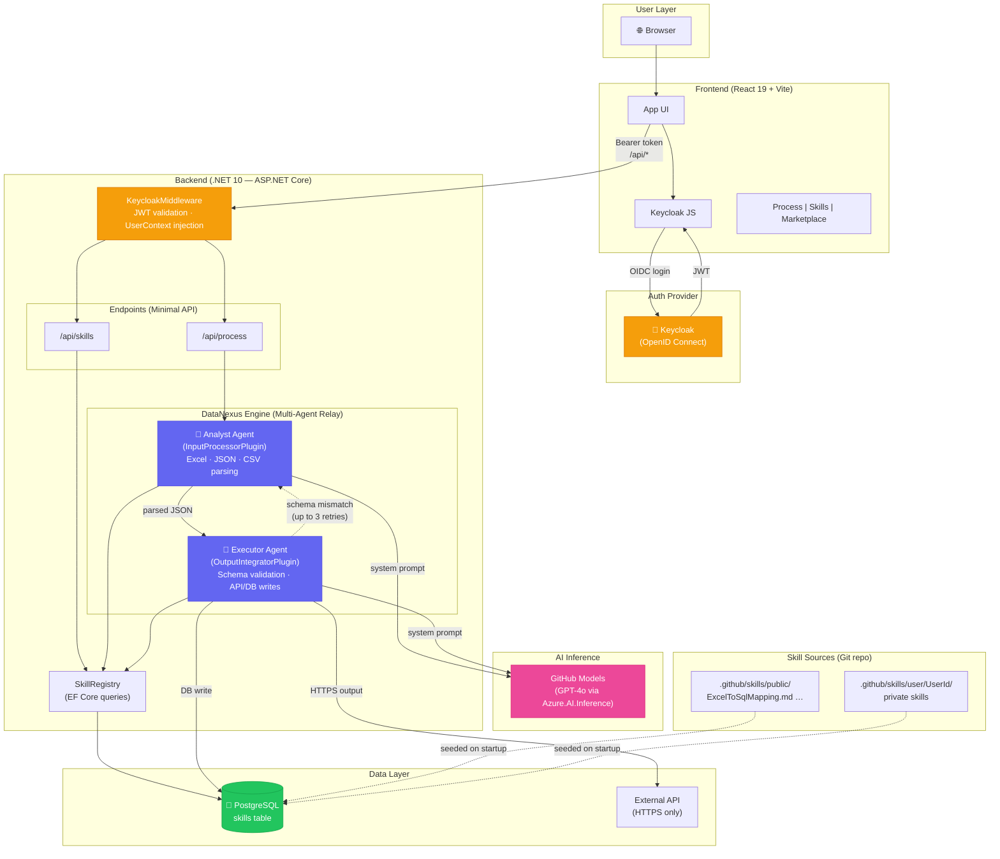

# DataNexus — Copilot Instructions

## Project Overview

DataNexus is a decentralized, multi-agent AI "Kernel" where users author, use, and share
**Skills** (agentic logic). It is structured as a **monorepo** with two workspaces:

| Workspace   | Path        | Stack                                             |
| ----------- | ----------- | ------------------------------------------------- |
| **Backend** | `backend/`  | .NET 10 (C# 13), ASP.NET Core Minimal APIs, EF Core + PostgreSQL |
| **Frontend**| `frontend/` | React 19, TypeScript, Vite                        |
| **Skills**  | `.github/skills/` | Shared markdown-based skill definitions      |

---

## Architecture



### Backend (The DataNexus System)

- **Auth**: Keycloak OpenID Connect. JWT validated via `Microsoft.AspNetCore.Authentication.JwtBearer`.
  `KeycloakMiddleware` injects a scoped `UserContext` and logs agent chatter with `[User: {Id}]`.
- **Agents**: Two-agent relay orchestrated by `DataNexusEngine`:
  - **AnalystAgent** — parses data (Excel/JSON/CSV via `InputProcessorPlugin`), applies skill
    instructions, outputs structured JSON.
  - **ExecutorAgent** — validates against destination schemas (`OutputIntegratorPlugin`),
    executes API/DB writes. Loops back to Analyst on schema mismatch (up to 3 attempts).
- **Skills**: Stored in PostgreSQL (`skills` table) via EF Core. `SkillRegistry` queries the
  database and injects instructions into agent system prompts at runtime.
  Built-in skills from `.github/skills/public/` are seeded into the DB on startup.
- **Database**: PostgreSQL via `Npgsql.EntityFrameworkCore.PostgreSQL`. Connection string in
  `ConnectionStrings:DataNexus`. Auto-migrated on startup.
- **Inference**: `Azure.AI.Inference` → GitHub Models (gpt-4o).

### Frontend (User-Facing UI)

- **Auth**: `keycloak-js` handles login/token lifecycle; token is passed as Bearer to backend.
- **Pages**: Process data, manage private skills, browse the public Skills Marketplace.
- **API proxy**: Vite dev server proxies `/api` to the backend at `localhost:5000`.

---

## Coding Conventions

### C# (Backend)

- Target `net10.0` with `LangVersion preview` (C# 12/13).
- Use **primary constructors** for DI on services and agents.
- Use **collection expressions** (`[]`) over `new List<>` / `Array.Empty<>`.
- Use `params ReadOnlySpan<T>` for flexible method signatures.
- Use **top-level statements** in `Program.cs` — no `Startup` class.
- Prefer records for data-transfer types.
- All user-facing actions must be scoped to the authenticated `UserId`.
- Log with the `[User: {UserId}]` prefix for auditability.
- SSRF protection: only HTTPS URIs allowed for downloads / API output.

### TypeScript (Frontend)

- Strict mode, `noUncheckedIndexedAccess`, no implicit `any`.
- Path alias `@/*` → `src/*`.
- Functional components only — use hooks for state.
- Keep API calls in `src/services/api.ts`; keep types in `src/types/`.

### Skills (Markdown)

- Stored in `.github/skills/public/` (shared) and `.github/skills/user/{UserId}/` (private).
- One `.md` file per skill. File name = skill name (kebab-case).
- Content is injected verbatim into agent system prompts — write clear, actionable instructions.

---

## Project Structure

```
DataNexus/                          ← monorepo root
├── .github/
│   ├── copilot-instructions.md     ← this file
│   └── skills/
│       ├── public/                 ← shared skills (e.g., ExcelToSqlMapping.md)
│       └── user/                   ← per-user private skills ({UserId}/*.md)
├── backend/
│   ├── DataNexus.csproj
│   ├── Program.cs
│   ├── appsettings.json
│   ├── Agents/                     ← AnalystAgent, ExecutorAgent, DataNexusEngine
│   ├── Core/                       ← ISkill, IPlugin, SkillRegistry, SkillDefinition
│   ├── Endpoints/                  ← Minimal API route groups
│   ├── Identity/                   ← KeycloakAuthService, KeycloakMiddleware, UserContext
│   ├── Models/                     ← Request/response records
│   └── Plugins/                    ← InputProcessorPlugin, OutputIntegratorPlugin
├── frontend/
│   ├── package.json
│   ├── tsconfig.json
│   ├── vite.config.ts
│   ├── index.html
│   └── src/
│       ├── main.tsx
│       ├── App.tsx
│       ├── components/             ← SkillsPanel, ProcessingPanel
│       ├── services/               ← auth.ts (Keycloak), api.ts (fetch wrapper)
│       ├── types/                  ← TypeScript interfaces mirroring backend DTOs
│       ├── hooks/
│       ├── pages/
│       └── styles/
└── DataNexus.sln                   ← solution file referencing backend/DataNexus.csproj
```

---

## Running Locally

```bash
# Backend
cd backend && dotnet run

# Frontend (separate terminal)
cd frontend && npm install && npm run dev
```

The Vite dev server on `:5173` proxies `/api` requests to the backend on `:5000`.

---

## Key Design Decisions

1. **Monorepo** — single repo for backend, frontend, and skills so all components version together.
2. **Skills as Markdown** — lightweight, git-diffable, easy for non-developers to author.
3. **Self-correcting agent loop** — the Executor can reject and loop back to the Analyst up to
   3 times, preventing bad data from reaching downstream systems.
4. **Scoped everything** — every agent action, skill access, and log entry is tied to `UserId`.
