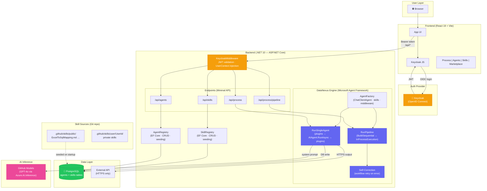

# DataNexus — Copilot Instructions

## Project Overview

DataNexus is a decentralized, multi-agent AI "Kernel" where users author, use, and share
**Skills** (agentic logic). It is structured as a **monorepo** with two workspaces:

| Workspace   | Path        | Stack                                             |
| ----------- | ----------- | ------------------------------------------------- |
| **Backend** | `backend/`  | .NET 10 (C# 13), ASP.NET Core Minimal APIs, EF Core + PostgreSQL |
| **Frontend**| `frontend/` | React 19, TypeScript, Vite                        |
| **Skills**  | `.github/skills/` | Shared markdown-based skill definitions      |

---

## Architecture



### Backend (The DataNexus System)

- **Auth**: Keycloak OpenID Connect. JWT validated via `Microsoft.AspNetCore.Authentication.JwtBearer`.
  `KeycloakMiddleware` injects a scoped `UserContext` and logs agent chatter with `[User: {Id}]`.
- **Agents** (composable): Stored in PostgreSQL (`agents` table) via EF Core. Users can create,
  customize, and publish agents. Each agent has:
  - `ExecutionType` — `Llm` (default) or `External` (CLI / script).
  - `SystemPrompt` — the LLM system instructions (LLM agents).
  - `Command` / `Arguments` / `WorkingDirectory` / `TimeoutSeconds` — execution metadata (external agents).
  - `Plugins` — comma-separated list (e.g. `InputProcessor,OutputIntegrator`).
  - `Skills` — comma-separated skill names injected into the system prompt at runtime.
  - `UiSchema` — JSON array defining the agent's custom UI fields (see **Agent UI Schema** below).
  - `Scope` — `Public` or `Private`; public agents are visible to all users.
  - Built-in agents (Data Analyst, API Integrator, Report Writer, Data Validator) are seeded on startup.
- **DataNexusEngine**: Dynamic agent orchestrator built on **Microsoft Agent Framework** (v1.0.0-rc4). Supports:
  - **AgentFactory** — creates `ChatClientAgent` (AF's `IChatClient`-backed `AIAgent`) from database-stored
    agent definitions. Resolves skills, builds instructions, and wraps with AF audit-logging middleware.
  - **Single-agent execution** — `AgentFactory.CreateAgentAsync()` → `AIAgent.RunAsync()`,
    with deterministic plugin sandwich (InputProcessor → LLM → OutputIntegrator).
  - **External agent execution** — `ExternalAgentAdapter` wraps `ExternalProcessRunner` as an AF `AIAgent`,
    enabling external CLI/script agents to participate in AF sequential workflows.
  - **Pipeline execution** — uses `AgentWorkflowBuilder.BuildSequential()` + `InProcessExecution.RunAsync()`
    to chain agents. Each agent's plugins are embedded as AF middleware for self-contained execution.
  - **Self-correction** — on plugin error or schema mismatch, retries the entire workflow (up to 3 attempts).
  - **Default mode** — if no `AgentId` specified, falls back to Analyst → Integrator workflow via `BuildSequential`.
- **External Agent Runtime** (`ExternalProcessRunner`):
  - Executes CLI / Python / Node / shell scripts as child processes.
  - **Protocol**: JSON on stdin → JSON on stdout. Exit code 0 = success.
  - **Security**: command allowlist (`ExternalAgents:AllowedCommands`), working directory allowlist,
    hard timeout cap (`ExternalAgents:MaxTimeoutSeconds`), no shell invocation (`UseShellExecute=false`).
  - Config section: `ExternalAgents` in `appsettings.json`.
- **Pipelines**: Stored in PostgreSQL (`pipelines` table) via EF Core. `PipelineRegistry` provides
  full CRUD (list, get, create, update, delete, publish). Each pipeline has:
  - `Name` — display name.
  - `AgentIds` — JSON array of agent IDs executed sequentially.
  - `EnableSelfCorrection` — whether to retry on schema mismatch.
  - `MaxCorrectionAttempts` — cap on retries (default 3).
  - `Scope` — `Public` or `Private`; publishable to marketplace.
  - REST API: `GET/POST/PUT/DELETE /api/pipelines`, `POST /api/pipelines/{id}/publish`.
- **Skills**: Stored in PostgreSQL (`skills` table) via EF Core. `SkillRegistry` queries the
  database and injects instructions into agent system prompts at runtime.
  Built-in skills from `.github/skills/public/` are seeded into the DB on startup.
- **Plugins**: C# classes that perform real I/O before or after the LLM call. Registered per-agent
  via the `Plugins` comma-separated field. Two built-in plugins:
  - `InputProcessor` — runs **before** the LLM: parses Excel / CSV / JSON, downloads URLs.
  - `OutputIntegrator` — runs **after** the LLM: executes API calls, database writes, validates schemas.

#### Skills vs Plugins

| Aspect        | Skills                              | Plugins                                  |
| ------------- | ----------------------------------- | ---------------------------------------- |
| **What**      | Markdown text                       | C# code (implements `IPlugin`)           |
| **When**      | Injected into system prompt before LLM call | Execute before/after the LLM call   |
| **Purpose**   | Shape *how the LLM thinks*          | Give the agent *ability to act*          |
| **Authored by** | Any user (markdown)               | Developers (backend code)                |
| **Side effects** | None — passive knowledge         | Yes — file I/O, HTTP, database writes    |

Execution flow per LLM agent:
```
InputProcessor plugin (optional) → LLM (with skill-enriched prompt) → OutputIntegrator plugin (optional)
```

**Skills cannot invoke plugins.** This is an intentional security boundary. Skills are user-authored
untrusted text; plugins perform privileged side effects. Allowing skills to trigger plugins would be
a privilege escalation vector. Plugin activation is controlled exclusively by the agent's `Plugins`
configuration field, evaluated by the engine — never by skill content.

- **Database**: PostgreSQL via `Npgsql.EntityFrameworkCore.PostgreSQL`. Connection string in
  `ConnectionStrings:DataNexus`. Auto-migrated on startup.
- **Compression**: Response compression (Brotli + Gzip) compresses all API responses. Request
  decompression accepts gzip-compressed request bodies from the frontend. The frontend auto-compresses
  request bodies larger than 1 KB using the browser's `CompressionStream` API with `Content-Encoding: gzip`.
- **Inference**: `IChatClient` from `Microsoft.Extensions.AI` via `OpenAI` SDK → GitHub Models (gpt-4o).
  All LLM agents are `ChatClientAgent` instances from Microsoft Agent Framework, backed by this `IChatClient`.

### Agent UI Schema

Each agent stores a `UiSchema` JSON array that defines the custom UI fields shown when the agent
is selected on the Process page. The frontend renders these dynamically. Field types:

| Type       | Renders As             | Extra Properties          |
| ---------- | ---------------------- | ------------------------- |
| `file`     | File drop zone         | `accept` (e.g. `.xlsx`)   |
| `text`     | Single-line input      | `placeholder`             |
| `textarea` | Multi-line input       | `placeholder`             |
| `url`      | URL input              | `placeholder`             |
| `select`   | Dropdown               | `options` (string array)  |
| `number`   | Numeric input          | `placeholder`             |
| `toggle`   | Checkbox + label       | `default` (`"true"/"false"`) |

Example (Data Analyst):
```json
[
  { "key": "file", "label": "Data File", "type": "file", "accept": ".xlsx,.csv,.json", "required": true },
  { "key": "task", "label": "Task Description", "type": "textarea", "placeholder": "Describe the transformation..." },
  { "key": "outputFormat", "label": "Output Format", "type": "select", "options": ["JSON","CSV","SQL"] }
]
```

### Frontend (User-Facing UI)

- **Auth**: `keycloak-js` handles login/token lifecycle; token is passed as Bearer to backend.
- **Pages**: Process (dynamic agent UI), Agents (create/publish/compose pipelines),
  Skills (manage), Marketplace (browse public agents + skills).
- **Dynamic Agent UI**: When a user selects an agent on the Process page, the form fields
  are rendered dynamically from the agent's `uiSchema`. Each agent has its own tailored input form.
- **API proxy**: Vite dev server proxies `/api` to the backend at `localhost:5000`.

---

## Coding Conventions

### C# (Backend)

- Target `net10.0` with `LangVersion preview` (C# 12/13).
- Use **primary constructors** for DI on services and agents.
- Use **collection expressions** (`[]`) over `new List<>` / `Array.Empty<>`.
- Use `params ReadOnlySpan<T>` for flexible method signatures.
- Use **top-level statements** in `Program.cs` — no `Startup` class.
- Prefer records for data-transfer types.
- All user-facing actions must be scoped to the authenticated `UserId`.
- Log with the `[User: {UserId}]` prefix for auditability.
- SSRF protection: only HTTPS URIs allowed for downloads / API output.

### TypeScript (Frontend)

- Strict mode, `noUncheckedIndexedAccess`, no implicit `any`.
- Path alias `@/*` → `src/*`.
- Functional components only — use hooks for state.
- Keep API calls in `src/services/api.ts`; keep types in `src/types/`.

### Skills (Markdown)

- Stored in `.github/skills/public/` (shared) and `.github/skills/user/{UserId}/` (private).
- One `.md` file per skill. File name = skill name (kebab-case).
- Content is injected verbatim into agent system prompts — write clear, actionable instructions.

---

## Project Structure

```
DataNexus/                          ← monorepo root
├── .github/
│   ├── copilot-instructions.md     ← this file
│   └── skills/
│       ├── public/                 ← shared skills (e.g., ExcelToSqlMapping.md)
│       └── user/                   ← per-user private skills ({UserId}/*.md)
├── backend/
│   ├── DataNexus.csproj
│   ├── Program.cs
│   ├── appsettings.json
│   ├── Agents/
│   │   ├── DataNexusEngine.cs                  — orchestration engine (AF workflows)
│   │   ├── AgentFactory.cs                     — creates ChatClientAgent from AgentDefinition
│   │   ├── ExternalAgentAdapter.cs             — wraps ExternalProcessRunner as AF AIAgent
│   │   ├── ExternalProcessRunner.cs            — CLI process execution (security boundary)
│   │   ├── ExternalAgentOptions.cs             — command allowlist / timeout config
│   │   └── IAgentExecutionRuntime.cs           — runtime interface
│   ├── Core/                       ← AgentEntity, AgentRegistry, PipelineEntity, PipelineRegistry, SkillRegistry, SkillDefinition
│   ├── Endpoints/                  ← ProcessingEndpoints, AgentEndpoints, PipelineEndpoints, SkillsEndpoints
│   ├── Identity/                   ← KeycloakAuthService, KeycloakMiddleware, UserContext
│   ├── Models/                     ← Request/response records
│   └── Plugins/                    ← InputProcessorPlugin, OutputIntegratorPlugin
├── frontend/
│   ├── package.json
│   ├── tsconfig.json
│   ├── vite.config.ts
│   ├── index.html
│   ├── preview.html                ← static UI mockup with dynamic agent UI
│   └── src/
│       ├── main.tsx
│       ├── App.tsx
│       ├── components/             ← AgentCard, AgentSelector, CreateAgentForm, DynamicForm,
│       │                              ErrorBoundary, Layout, PipelineBuilder, ProcessingPanel,
│       │                              QuickActions, RecentTasks, ResultBox, SavedPipelines, SkillsPanel
│       ├── services/               ← auth.ts (Keycloak), api.ts (fetch wrapper)
│       ├── types/                  ← TypeScript interfaces mirroring backend DTOs
│       ├── hooks/                  ← useAgents, usePipelines, useSkills
│       ├── pages/                  ← ProcessPage, AgentsPage, SkillsPage, MarketplacePage
│       └── styles/
└── DataNexus.sln                   ← solution file referencing backend/DataNexus.csproj
```

---

## Running Locally

```bash
# Backend
cd backend && dotnet run

# Frontend (separate terminal)
cd frontend && npm install && npm run dev
```

The Vite dev server on `:5173` proxies `/api` requests to the backend on `:5000`.

---

## Key Design Decisions

1. **Monorepo** — single repo for backend, frontend, and skills so all components version together.
2. **Skills as Markdown** — lightweight, git-diffable, easy for non-developers to author.
3. **Self-correcting agent loop** — the Executor can reject and loop back to the Analyst up to
   3 times, preventing bad data from reaching downstream systems.
4. **Scoped everything** — every agent action, skill access, and log entry is tied to `UserId`.
5. **Composable agents** — users create custom agents with their own system prompts, plugins,
   skills, and UI schemas. Agents can be chained into pipelines for complex workflows.
6. **Dynamic UI per agent** — each agent defines a `uiSchema` JSON array. The frontend renders
   the appropriate form fields when the user selects that agent on the Process page.
7. **External agent runtime** — users can register CLI tools, Python scripts, or Node programs
   as agents. The engine executes them as child processes with a stdin/stdout JSON protocol,
   guarded by a command allowlist, timeout cap, and working-directory allowlist.
8. **Skills ≠ Plugins (strict separation)** — skills are passive markdown injected into prompts;
   plugins are executable C# code that performs I/O. Skills cannot invoke plugins. This is a
   deliberate security boundary: skill authors (any user) must not be able to trigger privileged
   actions (API calls, DB writes) that only agent-configured plugins should perform.
