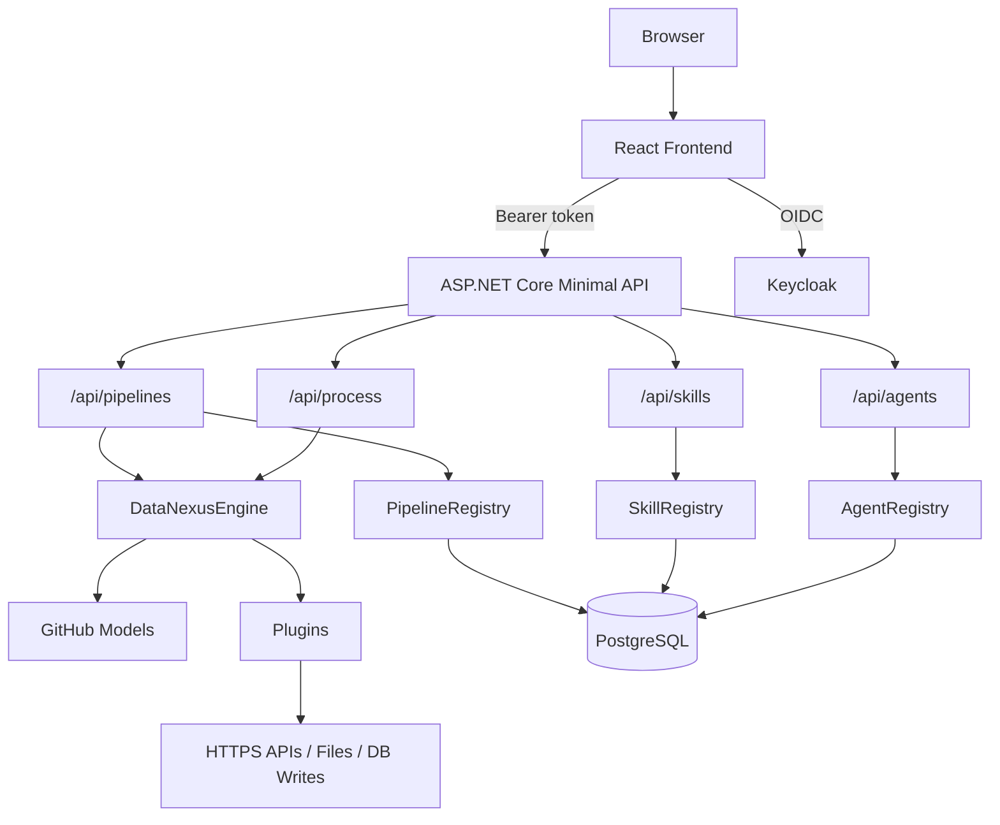

# DataNexus

DataNexus is a multi-agent AI kernel for building, running, and sharing composable AI agents, pipelines, and SKILL.md-based skills.

It is a monorepo with:
- `backend/` — .NET 10 minimal API, EF Core, PostgreSQL, Keycloak auth, GitHub Models inference
- `frontend/` — React 19, TypeScript, Vite
- `.github/skills/` — shared and user-authored SKILL.md packages

## Overview

DataNexus separates three concerns:
- `Agents` define behavior, execution mode, attached plugins, and UI schema.
- `Skills` are file-backed `SKILL.md` packages exposed through Microsoft Agent Framework context providers.
- `Pipelines` chain agents together for multi-step workflows.

The backend supports both:
- LLM agents using GitHub Models
- External agents executed as local CLI or script processes

## Architecture



## Core Concepts

### Agents
Agents are the executable units in the system.

Each agent can be:
- `Llm` — prompt-driven, executed through GitHub Models
- `External` — executed through a local command using stdin/stdout JSON

An agent includes:
- name, icon, description
- system prompt
- optional plugins
- optional skills
- dynamic UI schema
- ownership and visibility (`Private` or `Public`)

### Skills
Skills are file-backed `SKILL.md` packages discovered from `.github/skills/` and exposed to agents through Microsoft Agent Framework skill context providers.

They are used to:
- encode domain instructions
- standardize transformations
- shape model output without changing code

The current runtime uses `FileAgentSkillsProvider`, which advertises selected skills to the model and loads full skill content or static resources on demand.
Skills are passive in the current product surface. They do not execute code and cannot invoke plugins.

### Pipelines
Pipelines connect multiple agents in sequence.

They support:
- ordered execution by agent ID list
- self-correction retries on schema mismatch
- live streamed execution updates via NDJSON endpoints
- publish / unpublish / clone flows

### Plugins
Plugins give agents side-effect capabilities.

Built-in plugins:
- `InputProcessor` — parses Excel, CSV, JSON, and URLs into structured input
- `OutputIntegrator` — validates output and performs downstream integrations

## Security Model

DataNexus is scoped around authenticated users.

Key rules:
- private resources are only readable and editable by their owner
- public resources are visible to all authenticated users
- edit/delete is owner-only
- clone is allowed for any visible item
- publish moves a private resource to public visibility
- unpublish restores private ownership using `PublishedByUserId`
- skills are untrusted text and cannot trigger plugins
- external agents are restricted by command allowlist, working-directory allowlist, and timeout limits
- plugin/network integrations are expected to use HTTPS-only destinations

## Project Structure

```text
DataNexus/
├── .github/
│   ├── copilot-instructions.md
│   └── skills/
│       ├── public/
│       └── user/
├── backend/
│   ├── Agents/
│   ├── Core/
│   ├── Endpoints/
│   ├── Identity/
│   ├── Models/
│   ├── Plugins/
│   ├── DataNexus.csproj
│   ├── Program.cs
│   ├── appsettings.json
│   └── appsettings.sample.json
├── frontend/
│   ├── src/
│   ├── package.json
│   ├── vite.config.ts
│   └── preview.html
├── scripts/
│   └── start-dev.sh
└── DataNexus.sln
```

## Requirements

Install locally:
- .NET SDK 10
- Node.js and npm
- PostgreSQL
- Keycloak realm/client configuration
- GitHub Models access token

## Configuration

Use the sample config as a starting point:
- `backend/appsettings.sample.json`

Create your local config:
- copy `backend/appsettings.sample.json` to `backend/appsettings.json`
- fill in the database connection string and GitHub Models API key

Important notes:
- `backend/appsettings.json` is intentionally ignored by git
- the checked-in sample config is safe to commit

Relevant config sections:
- `DatabaseProvider`
- `ConnectionStrings:DataNexus`
- `Keycloak`
- `GitHubModels`
- `ExternalAgents`

Current recommended model default:
- `gpt-5-mini`

## Running Locally

### Option 1: Start both apps with one script

```bash
sh scripts/start-dev.sh
```

What it does:
- kills processes using ports `5000` and `5173`
- starts backend on `http://localhost:5000`
- starts frontend on `http://localhost:5173`
- writes logs to `.logs/backend.log` and `.logs/frontend.log`

### Option 2: Start manually

Backend:
```bash
cd backend
dotnet run
```

Frontend:
```bash
cd frontend
npm install
npm run dev
```

## Database Behavior

The app uses EF Core with PostgreSQL.

For a fresh PostgreSQL database:
- startup explicitly calls `EnsureCreatedAsync()`
- tables are created automatically on first run
- no EF migration workflow is required for the intended deployment model

## Frontend Pages

### Process
Use an agent or pipeline to process input.

Features:
- dynamic form rendering from agent UI schema
- task execution
- pipeline execution
- live execution stream while runs are in progress
- recent task history

### Agents
Manage agents and pipelines.

Features:
- create and edit custom agents
- publish, unpublish, clone, delete
- compose pipelines visually
- publish, unpublish, clone, edit, delete pipelines

### Skills
Manage prompt skills.

Features:
- create and edit skills
- publish, unpublish, clone, delete
- rename private skills

### Marketplace
Browse public resources.

Features:
- public agents
- public skills
- plugin catalog

## API Surface

Main route groups:
- `/api/process`
- `/api/process/stream`
- `/api/process/pipeline`
- `/api/process/pipeline/stream`
- `/api/agents`
- `/api/skills`
- `/api/pipelines`
- `/api/orchestrations/{id}/run/stream`
- `/api/tasks`

Typical resource actions:
- list
- get by id
- create
- update
- delete
- clone
- publish
- unpublish

## External Agent Protocol

External agents communicate using JSON over stdin/stdout.

Input shape:
```json
{
  "input": "...",
  "parameters": {},
  "userId": "..."
}
```

Expected stdout shape:
```json
{
  "success": true,
  "message": "...",
  "data": {}
}
```

Rules:
- exit code `0` means success
- non-zero exit code means failure
- the command must be allowed by `ExternalAgents:AllowedCommands`

## Development Notes

### Ownership and visibility
- private items belong to `OwnerId`
- public items retain `PublishedByUserId` so the publisher can unpublish later
- per-ID reads are protected by ownership checks

### Error handling
Expected business-rule failures return proper API responses:
- `404` not found / inaccessible resource
- `403` forbidden unpublish attempt
- `409` duplicate-name conflict

### Ignored local artifacts
Ignored by git:
- `backend/appsettings.json`
- `.logs/`
- `*.tsbuildinfo`

## Recommended Workflow

1. Configure `backend/appsettings.json` from the sample.
2. Make sure PostgreSQL is running and the database is reachable.
3. Start the backend and frontend.
4. Sign in through Keycloak.
5. Create or select agents and skills.
6. Build pipelines for multi-step execution.
7. Publish resources to the marketplace when ready.

## Troubleshooting

### Frontend cannot reach backend
Check:
- backend running on port `5000`
- frontend running on port `5173`
- Vite proxy configuration

### Auth issues
Check:
- Keycloak authority URL
- client audience
- realm/client setup
- JWT claims used for `UserIdClaim`

### Model call failures
Check:
- `GitHubModels:ApiKey`
- selected model availability in your GitHub Models account
- `GitHubModels:Model` value such as `gpt-5-mini` or fallback `gpt-4o-mini`

### External agent failures
Check:
- command is allowlisted
- working directory is allowlisted
- stdout contains valid JSON
- timeout is sufficient

## License / Notes

Add your repository license and contribution policy here if needed.
